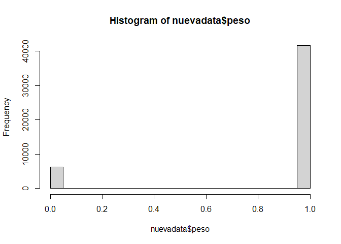

Proyecto fin de modulo 6
================
Teddy Horacio Alvarez Zarate
2023-11-06

# Seccion A

## Cargando las librerías

``` r
library(tidyverse)
```

    ## Warning: package 'tidyverse' was built under R version 4.2.3

    ## Warning: package 'ggplot2' was built under R version 4.2.3

    ## Warning: package 'tibble' was built under R version 4.2.3

    ## Warning: package 'tidyr' was built under R version 4.2.3

    ## Warning: package 'readr' was built under R version 4.2.3

    ## Warning: package 'purrr' was built under R version 4.2.3

    ## Warning: package 'dplyr' was built under R version 4.2.3

    ## Warning: package 'forcats' was built under R version 4.2.3

    ## Warning: package 'lubridate' was built under R version 4.2.3

    ## ── Attaching core tidyverse packages ──────────────────────── tidyverse 2.0.0 ──
    ## ✔ dplyr     1.1.3     ✔ readr     2.1.4
    ## ✔ forcats   1.0.0     ✔ stringr   1.5.0
    ## ✔ ggplot2   3.4.3     ✔ tibble    3.2.1
    ## ✔ lubridate 1.9.2     ✔ tidyr     1.3.0
    ## ✔ purrr     1.0.2     
    ## ── Conflicts ────────────────────────────────────────── tidyverse_conflicts() ──
    ## ✖ dplyr::filter() masks stats::filter()
    ## ✖ dplyr::lag()    masks stats::lag()
    ## ℹ Use the conflicted package (<http://conflicted.r-lib.org/>) to force all conflicts to become errors

``` r
library(foreign)
library(dplyr)
library(caret)
```

    ## Loading required package: lattice
    ## 
    ## Attaching package: 'caret'
    ## 
    ## The following object is masked from 'package:purrr':
    ## 
    ##     lift

``` r
library(ROCR)
```

    ## Warning: package 'ROCR' was built under R version 4.2.3

``` r
library(randomForest)
```

    ## Warning: package 'randomForest' was built under R version 4.2.3

    ## randomForest 4.7-1.1
    ## Type rfNews() to see new features/changes/bug fixes.
    ## 
    ## Attaching package: 'randomForest'
    ## 
    ## The following object is masked from 'package:dplyr':
    ## 
    ##     combine
    ## 
    ## The following object is masked from 'package:ggplot2':
    ## 
    ##     margin

``` r
library(e1071)
library(ggplot2)
```

## Cargando la base de datos

``` r
setwd("~/Experto en ciencia de datos/Modulo 6/Proyecto_modulo_6")

datos <- read.spss("ENV_2017.sav", use.value.labels = FALSE, to.data.frame = TRUE)
```

    ## re-encoding from CP1252

``` r
table(datos$prov_nac)
```

    ## 
    ##    01    02    03    04    05    06    07    08    09    10    11    12    13 
    ## 14454  2910  4523  2504  7543  7797 13179 14100 79788  8589  8106 18447 25161 
    ##    14    15    16    17    18    19    20    21    22    23    24 
    ##  5648  2891  2942 48865  9518  1916   353  4902  4678 12638  6800

``` r
datos$prov_nac <- as.numeric(as.character(datos$prov_nac))

nuevadata <- datos%>%
  filter(prov_nac==17)%>%
  select(peso, talla, sem_gest, sexo, edad_mad, sabe_leer, con_pren)%>%
  filter(peso!=99, talla!=99, sem_gest!=99, con_pren!=99, sabe_leer!=99, sabe_leer!=99)%>%
  mutate(peso=if_else(peso>2500, 1,0),
         sexo=if_else(sexo==1,0,1), sabe_leer=if_else(sabe_leer==1,1,0),
         con_pren=if_else(con_pren>=7,1,0), edad2=edad_mad^2)

hist(nuevadata$peso)
```

<!-- -->

## Including Plots

You can also embed plots, for example:

<!-- -->

Note that the `echo = FALSE` parameter was added to the code chunk to
prevent printing of the R code that generated the plot.
